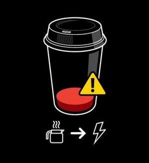

# Coffee Break Site ☕️

A modern, responsive, multi-page site about coffee — built with [Nuxt 4](https://nuxt.com/) and Vue 3.  
Inspired by the classic HTML/CSS version, now reimagined with reusable components and best practices.



## 🚀 Live Demo

[View Online (Netlify)](https://coffee-break-bygray.netlify.app/)

## 🛠️ Features

- *Nuxt 3 + Vue 3*: modern stack, modular architecture
- *Fully Responsive*: clean CSS, mobile-friendly
- *Multiple Pages*: Home, Variety, Place & Life Hack, Contact
- *Component-based*: headers, footers, navigation as components
- *Animated Letters*: hover effects on page titles
- *Scoped and Nested CSS*: maintainable, modern styles
- *No SCSS Processors*: only pure, modern CSS nesting
- *SPA*: fast navigation, no reloads

## 💻 Customization

・ All images are in public/img/
・ CSS: Main styles in assets/css/common.css
・ Add or change page meta via definePageMeta in each .vue file

## 🖥️ How to Run Locally

```bash
git clone https://github.com/GrayMurakami/vue-nuxt-coffee-break.git
cd 3d-calculator-nuxt
npm install
npm run dev
```
Visit http://localhost:3000 in your browser.


## 🏗️ Production
Build for production on Netlify:

```bash
npm run build
npm run preview
